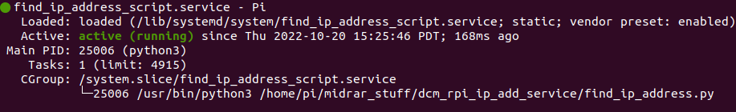

## Description:

This script gets the ip address of the current machine and send it over to a remote host. The remote host is the white linux computer that midrar is working on right now.

## Requirements:

- Install pip using the following command:
    - ```sudo apt install python3-pip```
- Install bcrypt using the following command:
    - ```sudo pip3 install -U "bcrypt<4.0.0"```
- Install paramiko using the following command:
    - ```sudo pip3 install paramiko```

## What does system service do?

We create a service to get systemd to run the python script every time the Pi boots.

### How to create a service?

- Type the following command to start creating a service:
    - ```sudo nano /lib/systemd/system/[name].service```
    - In the name field, write the name of the service that will be created.
    - Hint: Always use a short and easy name to remember; this code will be used by other colleagues.
- Within the file, paste the following:
```
[Unit]
Description=pi
After=network.target
[Service]
ExecStart=/usr/bin/python3 [PATH TO PYTHON SCRIPT]
Restart=always
User=pi
[install]
WantedBy=multi-user.target
```
- Change [PATH TO PYTHON SCRIPT] to the path where the Python script is located in you machine.
    - You can get the path where the Python scriptn is located by typing the following command:
        - ```pwd```
- Save and exit the service file.
- To run the service, type the following command:
    - sudo systemctl enable [name of the service]
    - sudo systemctl start [name of the service]
Once done, you should the following output indicating that the service is working:

